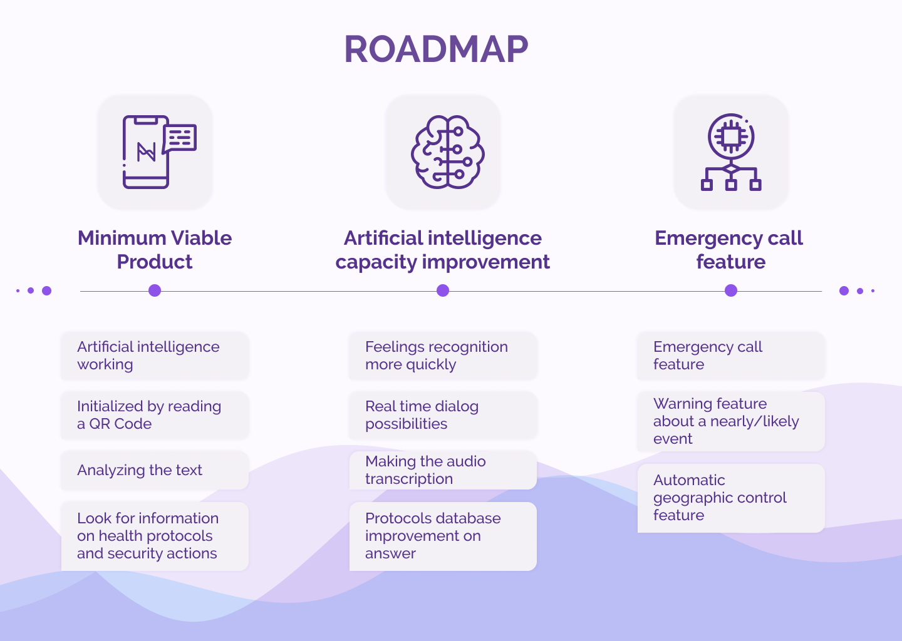

  

<h3 align="center">ANA &bull; Assistant to Normalize Activities</h3>

---

 Few lines describing your project.
      

## 📝 Table of Contents

- [Challenge](#challenge)
- [Problem Statement](#problem_statement)
- [Idea / Solution](#idea)
- [Roadmap](#future_scope)
- [Technology Stack](#tech_stack)
- [Authors](#authors)
- [Acknowledgments](#acknowledgments)

## 🧐 Challenge 

Mitigate the impact of COVID-19 and climate change by creating sustainable solutions using open source technology. Get the details on the 2020 Call for Code Global Challenge, understand its two tracks, and start building today.

## 🧐 Problem Statement 

According to psychoanalyst Maria Francisca Mauro, more than 100 days of quarantine, leaving to do the minimum necessary, brought us anguish, fear, uncertainty and many other feelings. However, now that the new measures to reopen commerce and other establishments are scheduled, the idea of ​​leaving home is not that simple. “Many feel fearful about the risk of contamination of themselves or someone in the family, since some share the home with people most vulnerable to COVID-19's clinical complications.

In order for people to return to their activities safely, several health protocols were created for each type of establishment. However, protocols are often long and tiring to read, which may not be effective in keeping people safe and reassured.

## 💡 Idea / Solution 

Thinking of helping everyone involved in this resumption of activities in a safe way, our team developed the Assistant to Normalize the Activities solution, ANA our assistant capable of analyzing the user's audio in a few seconds to check which procedure to take in relation to that information based on based on local, regional, national and global health protocols, informing and keeping the user safe quickly and easily.
ANA will also analyze the emotional traits of the user's audio which will allow their artificial intelligence to initiate a dialogue to calm the user in case he needs it, keeping him and the others in the same place safely.

## 🚀 Roadmap 

## ⛏️ Built With 

- [Figma](https://figma.com/) &bull; Design/UI
- [NodeJs](https://nodejs.org/) &bull; Back-End
- [ReactJS](https://reactjs.org/) &bull; Front-End
- [Discovery](https://www.ibm.com/cloud/watson-discovery) &bull; IBM Cloud Service
- [Watson Assistant](https://www.ibm.com/cloud/watson-assistant/) &bull; IBM Cloud Service #2

## ✍️ Team 

- [Alberthy](https://www.linkedin.com/in/alberthycoelho/) &bull; UX Designer
- [Antonio Carlos](https://www.linkedin.com/in/antonio-carlos149376b8/) &bull; Back-End
- [Esaú Morais](https://linkedin.com/in/emmorais) &bull; Front-End
- [Felipe Candian](https://www.linkedin.com/in/felipecandian/) &bull; UI/Motion Designer
- [Rodrigo Temóteo](https://www.linkedin.com/in/rodrigo-de-ara%C3%BAjo-tem%C3%B3teo-42020317/) &bull; Business

## 🎉 Acknowledgments 

- [IBM](https://ibm.com)
  - [IBM Cloud](https://cloud.ibm.com) Services
  - [Sérgio Gama](https://www.linkedin.com/in/sergiogama) overview and helping
- [Shawee](https://shawee.io)
